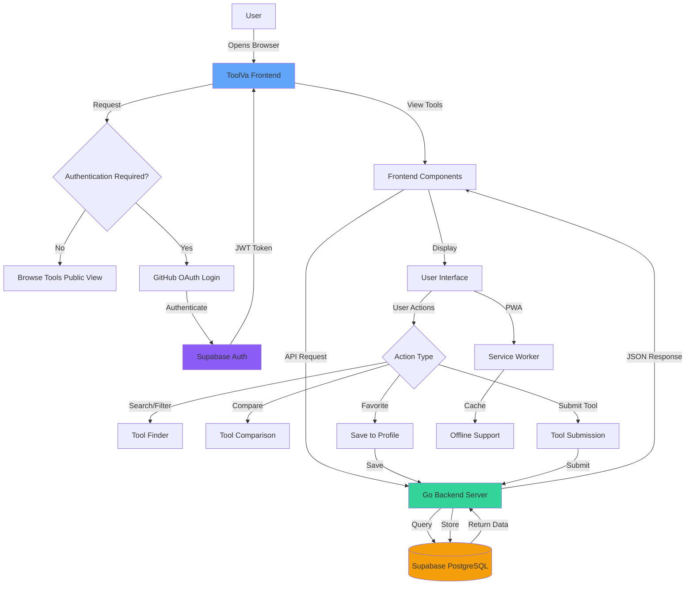

<div id="top"></div>

# ToolVa - The Ultimate AI Tools Directory 🚀

[](https://opensource.org/licenses/MIT)
[](https://nodejs.org)
[](https://golang.org)
[](CONTRIBUTING.md)
[](https://github.com/SUGAM-ARORA/toolva/stargazers)
[](https://github.com/SUGAM-ARORA/toolva/network/members)
[](https://github.com/SUGAM-ARORA/toolva/issues)
[](https://github.com/SUGAM-ARORA/toolva/graphs/contributors)

ToolVa is your one-stop destination for discovering, comparing, and learning about AI tools. With over 80 carefully curated tools across multiple categories, ToolVa helps you find the perfect AI solution for your needs.

**[Live Demo](https://toolva.vercel.app/) | [Documentation](./docs) | [Report Bug](https://github.com/SUGAM-ARORA/toolva/issues) | [Request Feature](https://github.com/SUGAM-ARORA/toolva/issues)**

---

## 📑 Table of Contents

- [About ToolVa](#-about-toolva)
- [Architecture](#️-architecture)
- [Project Flow](#-project-flow)
- [Project Structure](#-project-structure)
- [Prerequisites](#-prerequisites)
- [Installation & Setup](#-installation--setup)
- [Features](#-features)
- [Categories](#-categories)
- [Troubleshooting](#-troubleshooting)
- [Deployment](#-deployment)
- [Contributing](#-contributing)
- [License](#-license)
- [Acknowledgments](#-acknowledgments)
- [Maintainers](#-maintainers)
- [Contact Details](#-contact-details)
- [Contributors](#-contributors)
- [Repository Stats](#-repository-stats)

---

## 🌟 About ToolVa

ToolVa is a comprehensive AI Tools Directory platform that helps users discover, compare, and learn about AI tools. Built with modern web technologies, ToolVa provides an intuitive interface for exploring AI tools across multiple categories.

### Key Highlights
- 🎯 **10+ Unique Views** - Grid, Finder, Compare, Workflows, Learning Hub, and more
- 🔐 **Secure Authentication** - GitHub OAuth integration via Supabase
- 🌐 **Progressive Web App** - Install and use offline
- 🎨 **Beautiful UI** - Dark/Light mode with smooth animations
- 📊 **Advanced Comparison** - Compare tools side-by-side
- 🤖 **AI-Powered** - Smart recommendations and personalized suggestions

---

## 🏗️ Architecture

ToolVa uses a modern, scalable architecture with separate frontend and backend:

**Frontend:**
- React 18 + TypeScript
- Tailwind CSS for styling
- Vite for build tooling
- Framer Motion for animations
- React Router for navigation

**Backend:**
- Go 1.21+ with Gin framework
- PostgreSQL (via Supabase)
- JWT authentication
- RESTful API design

**Infrastructure:**
- Supabase for authentication & database
- PWA with service workers for offline support
- Google Analytics integration

---

## � Project Flow



### Flow Explanation

1. **User Access**
   - User opens ToolVa in browser
   - PWA capabilities allow installation as native app

2. **Authentication Flow**
   - Public browsing available without login
   - GitHub OAuth for user accounts
   - Supabase handles authentication securely
   - JWT tokens for session management

3. **Data Flow**
   - Frontend (React) makes API requests
   - Backend (Go) processes requests
   - PostgreSQL (Supabase) stores and retrieves data
   - Real-time updates via Supabase

4. **User Interactions**
   - **Search/Filter**: Find tools by category, features
   - **Compare**: Side-by-side tool comparison
   - **Favorites**: Save tools to profile (requires login)
   - **Submit**: Add new tools for review

5. **Offline Support**
   - Service workers cache resources
   - PWA enables offline browsing
   - Background sync for data updates

<p align="right">(<a href="#top">back to top</a>)</p>

---

## 📁 Project Structure

```
toolva/
├── backend/                 # Go backend
│   ├── cmd/                # Application entrypoint
│   ├── internal/           # Internal packages
│   │   ├── config/        # Configuration
│   │   ├── handlers/      # HTTP handlers
│   │   ├── middleware/    # Middleware
│   │   ├── models/        # Data models
│   │   └── services/      # Business logic
│   └── go.mod             # Go dependencies
├── src/                    # React frontend
│   ├── components/        # React components
│   ├── pages/             # Page components
│   ├── data/              # Static data
│   ├── lib/               # Utilities
│   └── types/             # TypeScript types
├── supabase/              # Supabase configuration
│   └── migrations/        # Database migrations
├── public/                # Static assets
├── .github/               # GitHub workflows & templates
├── CONTRIBUTING.md        # Contribution guidelines
├── SECURITY.md           # Security policy
├── CHANGELOG.md          # Version history
└── README.md             # This file
```

<p align="right">(<a href="#top">back to top</a>)</p>

---

## �📋 Prerequisites

Before you begin, ensure you have the following installed:

- **Node.js**: >= 18.0.0 (LTS recommended)
- **npm**: >= 9.0.0 or **yarn**: >= 1.22.0
- **Go**: >= 1.21 (for backend development)
- **Git**: Latest version
- **Supabase Account**: [Sign up here](https://supabase.com)

**Optional:**
- **Docker**: For containerized deployment

---

## 🚀 Installation & Setup

### Frontend Setup

1. **Clone the Repository**
   ```bash
   git clone https://github.com/SUGAM-ARORA/toolva.git
   cd toolva
   ```

2. **Install Dependencies**
   ```bash
   npm install
   # or
   yarn install
   ```

3. **Environment Configuration**
   
   Create a `.env` file in the root directory (use `.env.example` as reference):
   ```env
   # Supabase Configuration
   VITE_SUPABASE_URL=your_supabase_project_url
   VITE_SUPABASE_ANON_KEY=your_supabase_anon_key
   
   # Google Analytics (Optional)
   VITE_GA_TRACKING_ID=G-N87HLGF2NN
   
   # API Configuration
   VITE_API_URL=http://localhost:8080
   ```

4. **Start Development Server**
   ```bash
   npm run dev
   ```
   
   The application will be available at `http://localhost:5173`

### Backend Setup

1. **Navigate to Backend Directory**
   ```bash
   cd backend
   ```

2. **Install Go Dependencies**
   ```bash
   go mod download
   ```

3. **Environment Configuration**
   
   Create a `.env` file in the `backend` directory (use `backend/.env.example` as reference):
   ```env
   # Database Configuration
   DB_HOST=your_supabase_db_host
   DB_PORT=5432
   DB_USER=postgres
   DB_PASSWORD=your_database_password
   DB_NAME=postgres
   DB_SSLMODE=require
   
   # JWT Configuration
   JWT_SECRET=your_jwt_secret_key
   JWT_EXPIRATION=24h
   
   # Server Configuration
   PORT=8080
   GIN_MODE=debug
   ALLOWED_ORIGINS=http://localhost:5173,http://localhost:3000
   ```

4. **Start Backend Server**
   ```bash
   go run cmd/main.go
   ```
   
   The API will be available at `http://localhost:8080`

### Database Setup (Supabase)

1. Create a new Supabase project at [supabase.com](https://supabase.com)
2. Apply the database migrations from `supabase/migrations/`
3. Enable Row Level Security (RLS) policies
4. Configure authentication providers (GitHub OAuth)
5. Copy your project URL and anon key to the `.env` file

<p align="right">(<a href="#top">back to top</a>)</p>

---

## ✨ Features

### 🏠 Griha (Home/Grid View)
Browse all AI tools in a beautiful grid layout with category filters and advanced search functionality.

### 🔍 Veda (Smart Finder)
Find the perfect AI tool by describing your task. Our smart recommendation engine suggests the best matches based on your needs.

### ⚖️ Tulna (Compare Tools)
Side-by-side comparison of AI tools with detailed feature matrices, pricing analysis, and performance metrics.

### 👥 Vyakta (Persona Recommendations)
Get personalized tool recommendations based on your role - Developer, Designer, Writer, Marketer, and more.

### 🧠 Uttara (Prompt Explorer)
Explore and discover effective AI prompts for various tools and use cases to get the best results.

### 🔄 Disha (Workflow Builder)
Create and visualize AI-powered workflows by combining multiple tools to automate your tasks.

### 🎓 Vidya (AI Learning Hub)
Learn about AI concepts, best practices, and tool usage through comprehensive guides and tutorials.

### 📖 Medha (AI Terms Dictionary)
Comprehensive dictionary of AI-related terms, concepts, and technologies to help you understand the AI landscape.

### 🏆 Saptak (Weekly Recommendations)
Curated weekly tool recommendations, trending AI tools, and community highlights.

### ⚡ Samarp (Submit Tool)
Submit new AI tools to the directory for review and inclusion in our curated collection.

### Additional Features
- 🌙 **Dark/Light Mode** - Beautiful interface that adapts to your preference
- 👤 **User Accounts** - Save favorites and personalize your experience
- 📱 **Responsive Design** - Works perfectly on all devices
- 💾 **PWA Support** - Install ToolVa as a native app
- 🔐 **Secure Authentication** - GitHub OAuth integration
- 🔄 **Real-time Updates** - Live data synchronization

<p align="right">(<a href="#top">back to top</a>)</p>

---

## 🌟 Categories

Explore AI tools across multiple categories:

- 🤖 **Chatbots** - Conversational AI assistants
- 🎨 **Image Generation** - AI-powered image creation
- 💻 **Code** - Development and programming tools
- 🎵 **Music** - AI music generation and editing
- 🎬 **Video** - Video creation and editing tools
- ✍️ **Writing** - Content creation and copywriting
- 📚 **Education** - Learning and teaching tools
- 💼 **Business** - Productivity and business automation

<p align="right">(<a href="#top">back to top</a>)</p>

---

## 🔧 Troubleshooting

### Common Issues

#### Frontend Issues

**Issue: `Module not found` errors**
```bash
# Solution: Clear node_modules and reinstall
rm -rf node_modules package-lock.json
npm install
```

**Issue: Supabase connection errors**
- Verify your `.env` file has correct Supabase credentials
- Check if your Supabase project is active
- Ensure API keys are not expired

**Issue: Build fails with TypeScript errors**
```bash
# Clear TypeScript cache
rm -rf node_modules/.cache
npm run build
```

#### Backend Issues

**Issue: Database connection fails**
- Verify database credentials in `.env`
- Check if Supabase database is accessible
- Ensure SSL mode is configured correctly

**Issue: Port already in use**
```bash
# Windows
netstat -ano | findstr :8080
taskkill /PID <PID> /F

# Linux/Mac
lsof -ti:8080 | xargs kill -9
```

### Getting Help
- Check existing [GitHub Issues](https://github.com/SUGAM-ARORA/toolva/issues)
- Read our [Contributing Guide](CONTRIBUTING.md)
- Email: sugam.arora23@gmail.com

<p align="right">(<a href="#top">back to top</a>)</p>

---

## 🚀 Deployment

### Frontend Deployment (Vercel/Netlify)

1. **Build the Project**
   ```bash
   npm run build
   ```

2. **Deploy to Vercel**
   ```bash
   npm i -g vercel
   vercel --prod
   ```

3. **Environment Variables**
   - Configure all `VITE_*` variables in your hosting platform
   - Ensure Supabase credentials are set correctly

### Backend Deployment

1. **Using Docker**
   ```bash
   cd backend
   docker build -t toolva-backend .
   docker run -p 8080:8080 toolva-backend
   ```

2. **Using Go Binary**
   ```bash
   cd backend
   go build -o server cmd/main.go
   ./server
   ```

<p align="right">(<a href="#top">back to top</a>)</p>

---

## 🤝 Contributing

We love contributions! Whether it's bug fixes, new features, or documentation improvements, we welcome pull requests from developers of all skill levels.

See our [Contributing Guide](CONTRIBUTING.md) for detailed information on:
- Code of Conduct
- Development workflow
- Pull request process
- Coding standards

---

## 📄 License

This project is licensed under the MIT License - see the [LICENSE](LICENSE) file for details.

---

## 🙏 Acknowledgments

- All the amazing AI tool creators
- Our wonderful community of contributors
- [Lucide](https://lucide.dev/) for beautiful icons
- [Tailwind CSS](https://tailwindcss.com/) for styling
- [Supabase](https://supabase.com/) for backend services
- [Vite](https://vitejs.dev/) for blazing fast builds

---

## 🧑‍💼 Maintainers

<div>
<table>
<tr>
<td align="center"><a href="https://github.com/SUGAM-ARORA"></a></br> <h4 style="color:cyan;">Sugam Arora</h4>
 <a href="https://www.linkedin.com/in/sugamarora23/"></img></a>
 <a href="https://github.com/SUGAM-ARORA"></img></a>

   </td>
<td align="center"><a href="https://github.com/Ojas-Arora"></a></br> <h4 style="color:cyan;">Ojas Arora</h4>
 <a href="https://www.linkedin.com/in/ojasarora14/"></img></a>
 <a href="https://github.com/Ojas-Arora"></img></a>
   </td>
</tr>

</table>

</div>

---

## 📬 Contact Details

You can connect with us on various platforms:<br>
[](https://linkedin.com/in/sugam-arora-117265142) [](https://instagram.com/sugam.arora.393?utm_source=qr&igshid=MzNlNGNkZWQ4Mg%3D%3D) [](https://twitter.com/SugamArora14) [](https://facebook.com/sugam.arora.393)[](https://youtube.com/@sugamarora5997)
[](mailto:sugam.arora23@gmail.com)

---

## 👥 Contributors

Thanks to these wonderful people who have contributed to ToolVa:

<a href="https://github.com/SUGAM-ARORA/toolva/graphs/contributors">
  
</a>

---

## 📊 Repository Stats

<div align="center">


</div>

---

<div align="center">

**Made with ❤️ by the ToolVa Community**

If you find this project helpful, please consider giving it a ⭐️

</div>

---

<div align="center">
  <a href="#top">
    
  </a>
</div>
