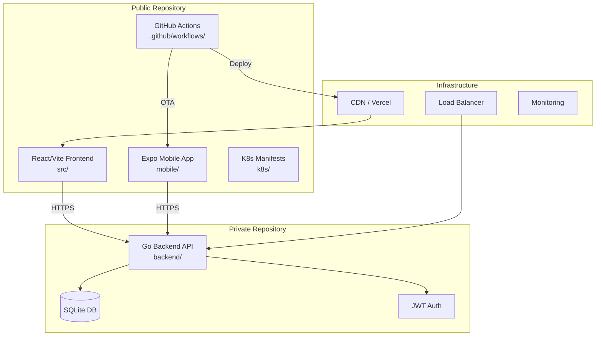
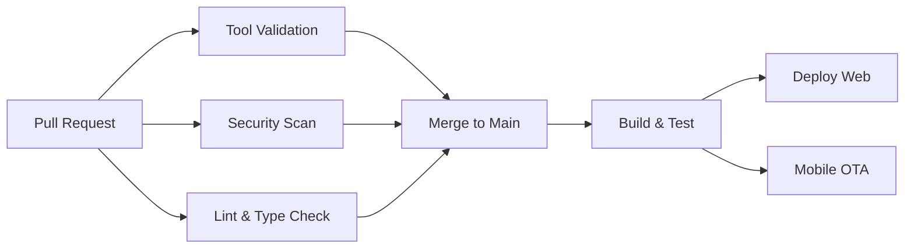

<div align="center">


# 🚀 Toolva — The Ultimate AI Tools Directory

[](LICENSE)
[](https://react.dev)
[](https://typescriptlang.org)
[](https://vitejs.dev)
[](https://go.dev)
[](https://expo.dev)
[](CONTRIBUTING.md)
[](SECURITY.md)

**Discover, compare, and review 500+ AI tools — all in one place.**\
Open-source. Community-driven. Mobile-first.

[🌐 Live Demo](https://toolva.com) · [📱 Mobile App](https://expo.dev/@toolva) · [📖 API Docs](backend/README.md) · [🐛 Report Bug](https://github.com/SUGAM-ARORA/Toolva/issues) · [💡 Request Feature](https://github.com/SUGAM-ARORA/Toolva/issues)

</div>

---

## 📋 Table of Contents

- [✨ Features](#-features)
- [🏗️ Architecture](#️-architecture)
- [🛠️ Tech Stack](#️-tech-stack)
- [🚀 Getting Started](#-getting-started)
- [📁 Project Structure](#-project-structure)
- [🐳 Docker Deployment](#-docker-deployment)
- [☸️ Kubernetes Deployment](#️-kubernetes-deployment)
- [🔒 Security](#-security)
- [📱 Mobile App](#-mobile-app)
- [🤝 Contributing](#-contributing)
- [📊 CI/CD Pipeline](#-cicd-pipeline)
- [🗺️ Roadmap](#️-roadmap)
- [👥 Team](#-team)
- [📬 Contact](#-contact)
- [⭐ Star History](#-star-history)

---

## ✨ Features

| Feature | Description |
|---------|-------------|
| 🔍 **Smart Search** | AI-powered search with filters by category, pricing, and rating |
| 📊 **Tool Comparison** | Side-by-side comparison of AI tools with detailed metrics |
| ⭐ **Community Reviews** | User ratings and reviews for every tool |
| 🏷️ **20+ Categories** | Chatbots, Image Gen, Code, Music, Video, Writing, and more |
| 🌙 **Dark Mode** | Beautiful dark-first UI with glassmorphism design |
| 📱 **Mobile App** | Native iOS/Android app via Expo with OTA updates |
| 🔐 **Secure Architecture** | Private backend, JWT auth, CORS, XSS prevention |
| 🤖 **PR Automation** | Automated validation for tool submission PRs |
| 📈 **Analytics** | Google Analytics 4 integration with custom events |
| ♿ **Accessible** | WCAG 2.1 compliant, keyboard navigable, screen-reader friendly |
| 🌐 **PWA** | Installable as a Progressive Web App with offline support |
| 🐳 **Containerized** | Full Docker & Kubernetes deployment ready |

---

## 🏗️ Architecture


```mermaid
graph TB
    subgraph "Public Repository"
        WEB["React/Vite Frontend\nsrc/"]
        MOB["Expo Mobile App\nmobile/"]
        CI["GitHub Actions\n.github/workflows/"]
        K8S["K8s Manifests\nk8s/"]
    end

    subgraph "Private Repository"
        API["Go Backend API\nbackend/"]
        DB[("SQLite DB")]
        JWT["JWT Auth"]
    end

    subgraph "Infrastructure"
        CDN["CDN / Vercel"]
        LB["Load Balancer"]
        MONITOR["Monitoring"]
    end

    WEB -->|HTTPS| API
    MOB -->|HTTPS| API
    API --> DB
    API --> JWT
    CDN --> WEB
    LB --> API
    CI -->|Deploy| CDN
    CI -->|OTA| MOB
```

### Design Principles

- **Separation of Concerns**: Frontend (public OSS) ↔ Backend (private) via REST API
- **Security by Default**: No secrets in frontend, JWT auth, CORS, rate limiting
- **Mobile-First**: Shared types/API patterns between web and mobile
- **Infrastructure as Code**: Docker Compose + Kubernetes manifests
- **Automated Quality Gates**: PR validation, security scanning, dependency auditing

---

## 🛠️ Tech Stack

| Layer | Technology | Version |
|-------|-----------|--------|
| **Frontend** | React + TypeScript | 19.0 + 5.7 |
| **Build** | Vite | 6.2 |
| **Styling** | Tailwind CSS | 3.4 |
| **Animation** | Framer Motion | 12.0 |
| **Backend** | Go + Gin | 1.23 + 1.10 |
| **Database** | SQLite (GORM) | 3.x |
| **Auth** | JWT (HMAC-SHA256) | v5 |
| **Mobile** | Expo (React Native) | 52 |
| **Container** | Docker + Nginx | 1.27 |
| **Orchestration** | Kubernetes | 1.28+ |
| **CI/CD** | GitHub Actions | v4 |
| **Security** | Gitleaks + CodeQL | Latest |

---

## 🚀 Getting Started

### Prerequisites

- **Node.js** ≥ 20.0 ([download](https://nodejs.org))
- **Go** ≥ 1.23 ([download](https://go.dev/dl)) — for backend development
- **Docker** ([download](https://docker.com)) — optional, for containerized deployment

### Quick Start (Frontend Only)

```bash
# Clone the repository
git clone https://github.com/SUGAM-ARORA/Toolva.git
cd Toolva

# Install dependencies
npm install

# Configure environment
cp .env.example .env

# Start development server
npm run dev
```

Open [http://localhost:5173](http://localhost:5173) 🎉

### Full Stack (Frontend + Backend)

```bash
# Terminal 1: Start backend
cd backend
cp .env.example .env
make run

# Terminal 2: Start frontend
npm run dev
```

### Docker (Recommended for Production)

```bash
# Full stack with one command
docker compose up -d

# Development mode with hot-reload
docker compose -f docker-compose.dev.yml up
```

---

## 📁 Project Structure

```
Toolva/
├── 📂 src/                    # React frontend source
│   ├── components/            # Reusable UI components
│   ├── pages/                 # Route pages
│   ├── data/                  # AI tools data (open for PRs)
│   ├── lib/                   # Utilities (API client, security)
│   └── types/                 # TypeScript interfaces
├── 📂 backend/                # Go API server (gitignored → private repo)
│   ├── cmd/main.go            # Entry point
│   ├── internal/              # Private packages
│   │   ├── config/            # Configuration management
│   │   ├── handlers/          # HTTP handlers
│   │   ├── middleware/        # Auth, CORS, rate limiting
│   │   ├── models/            # Database models
│   │   └── services/          # Business logic
│   ├── Dockerfile             # Container image
│   └── Makefile               # Build automation
├── 📂 mobile/                 # Expo React Native app
│   ├── App.tsx                # Entry point
│   ├── src/screens/           # App screens
│   └── src/lib/api.ts         # API client
├── 📂 k8s/                    # Kubernetes manifests
│   ├── frontend-deployment.yaml
│   ├── backend-deployment.yaml
│   ├── services.yaml
│   ├── ingress.yaml
│   └── hpa.yaml
├── 📂 .github/                # CI/CD & automation
│   ├── workflows/             # GitHub Actions
│   └── scripts/               # PR validation scripts
├── 🐳 Dockerfile              # Frontend container
├── 🐳 docker-compose.yml      # Full-stack orchestration
├── 📄 nginx.conf              # Production web server
└── 📄 CONTRIBUTING.md         # Contribution guide
```

---

## 🐳 Docker Deployment

```bash
# Production
docker compose up -d

# View logs
docker compose logs -f

# Scale backend
docker compose up -d --scale backend=3

# Stop
docker compose down
```

| Service | URL | Purpose |
|---------|-----|--------|
| Frontend | `http://localhost:3000` | React web app |
| Backend | `http://localhost:8080` | Go API server |
| Health | `http://localhost:8080/api/health` | Backend health check |

---

## ☸️ Kubernetes Deployment

```bash
# Deploy everything
kubectl apply -f k8s/

# Check status
kubectl get all -n toolva

# View logs
kubectl logs -f deployment/toolva-frontend -n toolva
```

See [k8s/README.md](k8s/README.md) for detailed instructions.

---

## 🔒 Security

| Layer | Protection |
|-------|------------|
| **Network** | HTTPS/TLS, CORS, rate limiting, K8s NetworkPolicies |
| **Auth** | JWT v5 (HMAC-SHA256), bcrypt password hashing |
| **Frontend** | XSS prevention, URL sanitization, CSP headers |
| **CI/CD** | Gitleaks (secrets), CodeQL (SAST), npm audit |
| **Container** | Non-root users, read-only filesystem, capability drops |
| **Dependencies** | Automated Dependabot alerts, weekly reviews |

Report vulnerabilities: [SECURITY.md](SECURITY.md)

---

## 📱 Mobile App

The Toolva mobile app is built with Expo (React Native) and shares core logic with the web frontend.

```bash
cd mobile
npm install
npx expo start
```

**Key features:**
- 📲 Native iOS + Android
- 🔄 OTA updates via Expo EAS
- 🌙 Dark mode by default
- 🔍 Search, browse, favorites

---

## 🤝 Contributing

We welcome contributions! Whether it's adding a new AI tool, fixing a bug, or improving documentation.

### Adding a New AI Tool (Most Common)

1. Fork the repository
2. Add your tool to `src/data/aiTools.ts`
3. Submit a PR — our bot will automatically validate it!

See [CONTRIBUTING.md](CONTRIBUTING.md) for the full guide.

---

## 📊 CI/CD Pipeline


```mermaid
graph LR
    PR["Pull Request"] --> VAL["Tool Validation"]
    PR --> SEC["Security Scan"]
    PR --> LINT["Lint & Type Check"]
    VAL --> MERGE["Merge to Main"]
    SEC --> MERGE
    LINT --> MERGE
    MERGE --> BUILD["Build & Test"]
    BUILD --> DEPLOY["Deploy Web"]
    BUILD --> OTA["Mobile OTA"]
```

| Workflow | Trigger | Actions |
|----------|---------|--------|
| PR Validation | PRs to `src/data/` | Validate tool entries, check URLs |
| Security Scan | All PRs & pushes | Gitleaks, CodeQL, npm audit |
| Deploy Web | Push to main | Build → Upload artifacts → Deploy |
| Mobile OTA | Push to main (`src/` or `mobile/`) | Expo EAS update |

---

## 🗺️ Roadmap

- [x] Core AI tools directory
- [x] User authentication & favorites
- [x] Mobile app (Expo)
- [x] Docker & Kubernetes deployment
- [x] CI/CD with automated PR validation
- [x] Security hardening
- [ ] AI-powered tool recommendations
- [ ] Tool comparison engine
- [ ] Community tool submissions portal
- [ ] API rate limiting dashboard
- [ ] i18n (internationalization)

---

## 👥 Team

<div align="center">
<table>
<tr>
<td align="center"><a href="https://github.com/SUGAM-ARORA"></a><br /><b>Sugam Arora</b><br /><sub>Creator & Lead</sub><br />
<a href="https://linkedin.com/in/sugamarora23"></a>
<a href="https://github.com/SUGAM-ARORA"></a>
</td>
<td align="center"><a href="https://github.com/Ojas-Arora"></a><br /><b>Ojas Arora</b><br /><sub>Core Contributor</sub><br />
<a href="https://linkedin.com/in/ojasarora14"></a>
<a href="https://github.com/Ojas-Arora"></a>
</td>
</tr>
</table>
</div>

---

## 📬 Contact

[](https://linkedin.com/in/sugam-arora-117265142)
[](https://twitter.com/SugamArora14)
[](mailto:sugam.arora23@gmail.com)
[](https://youtube.com/@sugamarora5997)

---

## ⭐ Star History

<div align="center">

[](https://star-history.com/#SUGAM-ARORA/Toolva&Date)

</div>

---

<div align="center">

**Made with ❤️ by the Toolva community**

[⬆ Back to Top](#-toolva--the-ultimate-ai-tools-directory)

</div>
